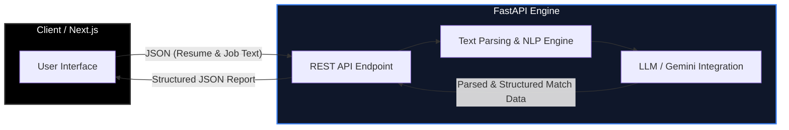

# 🚀 Job Fit Analyzer

*A hyper-clean, distraction-free ATS Resume & Job Description Keyword Matcher built with Next.js and Python FastAPI.*


[🚀 Live Demo](#) | [💻 Source Code](#) | [📄 API Docs](#)

---

## 🎨 Design Philosophy & Visual Showcase

### Minimalist UI Philosophy
In a landscape cluttered with complex recruitment tools, **Job Fit Analyzer** embraces a radical *content-first* approach. 
- **Zero Background Noise:** Stripped-down aesthetic that eliminates cognitive load.
- **Pure Typography:** Clean, monospace fonts for data input to emphasize structure.
- **Hyper-Legible Inputs:** Dual distraction-free zones for pasting CVs and Job Descriptions.
- **Instant Actionable Feedback:** No deep menus or hidden tabs. Just paste, analyze, and optimize.

### Visual Showcase
*(Insert UI Screenshots Here)*
| 📝 **Input Stage** | 📊 **Analysis Report** |
| :---: | :---: |
| Dual text area input for CV and Job Description. | Match Score (%), Matched Keywords, and Missing Skill Gaps. |

---

## ⚙️ System Architecture



---

## 🧠 Key Engineering Decisions & Trade-offs

> [!IMPORTANT]
> The architectural choices in this project prioritize **speed, precision, and privacy**.

- **Distraction-Free UI over Fancy Component Libraries:** 
  Heavy component libraries introduce unnecessary payload overhead and slow down render times. By using native HTML with Tailwind CSS utilities, we maintain a highly responsive, content-first layout that improves UX for high-volume job applications.
- **Python (FastAPI) over Node.js for Backend:** 
  While a full-stack Next.js/Node app is common, Python offers a vastly superior ecosystem for text processing, keyword extraction, and NLP/LLM integration. FastAPI provides an asynchronous, high-performance bridge to these tools with minimal latency.
- **Client-Side Data Privacy:** 
  Strict memory-only processing. CVs and Job Descriptions are parsed on the fly. There is **no permanent database storage**, ensuring that highly sensitive personal user data is never retained or exposed.
- **Asynchronous Parsing Pipeline:** 
  The text matching and LLM interaction pipelines are fully asynchronous. This ensures efficient payload handling, instantly parsing large text inputs without blocking the main server threads.

---

## ✨ Core Features Breakdown

- **📊 Match Score Calculator (%):** Algorithmic ratio analysis comparing candidate skills directly against job requirements.
- **🚨 Missing Skill Gap Identification:** Explicitly highlights omitted technologies, tools, and industry terms.
- **🔍 Keyword Density & Relevancy Analysis:** Filters out stop-words and isolates the hard technical skills that actually matter.
- **📄 ATS Optimization Insights:** Provides specific, actionable recommendations, preparing applicants for automated recruiting filters before applying.
- **📝 MAANG CV Generator:** Instantly rewrites the resume using Google's XYZ formula ("Accomplished [X] as measured by [Y], by doing [Z]"), outputting clean HTML ready to be pasted into MS Word.

---

## 🛠️ Tech Stack

| Category | Technologies |
| :--- | :--- |
| **Frontend** | Next.js (App Router), TypeScript, Tailwind CSS v4, Framer Motion, Lucide React |
| **Backend** | Python 3.11+, FastAPI, Pydantic, Uvicorn |
| **Analysis / NLP** | Google GenAI (Gemini 3.5 Flash) |
| **DevOps & Hosting** | Vercel (Frontend), Render/Railway (Backend), Docker, GitHub Actions |

---

## 💻 Local Development & Setup

Follow these steps to run the Job Fit Analyzer locally.

### 1. Clone the repository
```bash
git clone https://github.com/your-username/job-fit-analyzer.git
cd job-fit-analyzer
```

### 2. Backend Setup (FastAPI)
```bash
cd backend
python -m venv venv

# Activate virtual environment
# Windows:
.\venv\Scripts\activate
# Mac/Linux:
source venv/bin/activate

pip install -r requirements.txt

# Run the server
uvicorn main:app --reload --port 8001
```

### 3. Frontend Setup (Next.js)
Open a new terminal window.
```bash
cd frontend
npm install

# Run the development server
npm run dev
```

### 4. Environment Variables
Create a `.env` file in the **backend** directory:
```env
# backend/.env
GEMINI_API_KEY=your_google_gemini_api_key_here
```

Create a `.env.local` file in the **frontend** directory:
```env
# frontend/.env.local
NEXT_PUBLIC_API_URL=http://localhost:8001/api
```

---
*Built with 🖤 by an engineer, for engineers.*
